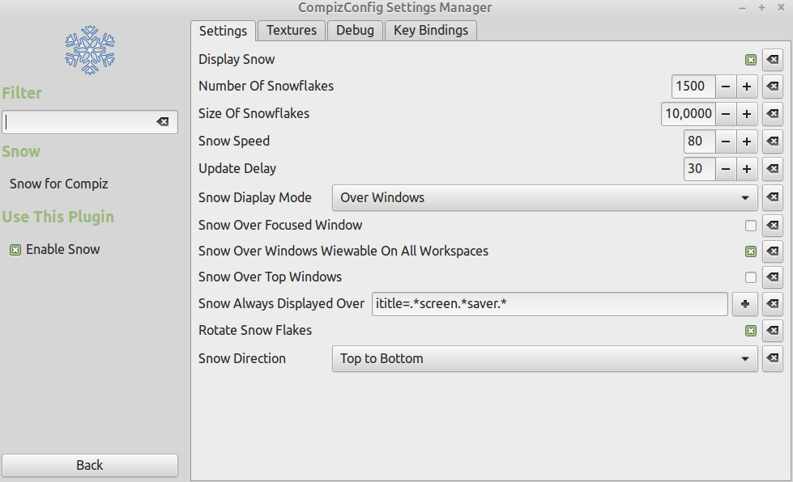

# compiz-plugin-snow
Compiz snow plugin (modified for Compiz greater than 0.9.14)
Plugin should work with both "Desktop Wall" and "Desktop Cube" plugins.

## Compilation and installation
To build the plugin you need to have installed packages
- compiz-dev
- libboost-dev

A local installation of the plugin can be done using: 
```sh
$ mkdir build
$ cd build
$ cmake ..
$ make install
```
Restarting compiz might be required to take configuration changes into account:
```sh
$ compiz --replace &
```

## Configuration
Configuration is done using "CompizConfig Settings Manager" (ccsm)

Default key bindings are:
- "Super + F3" to display/hide snow
- "Super + F4" to select the display mode (over windows, over desktop only, over the whole screen) 


